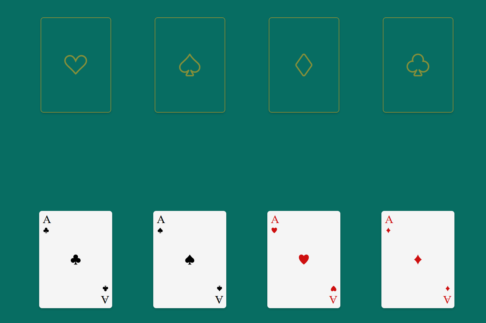

# Matching Aces

# About the game

This is a small game I made just because I wanted to test React Dnd and what can be done with it.

The thought is simply to drag and drop the cards to thier correct places, the ace of clubs on the spot marked with clubs and so on.

The condition is set so the Player won't be able do drop a card at the wrong postition.

